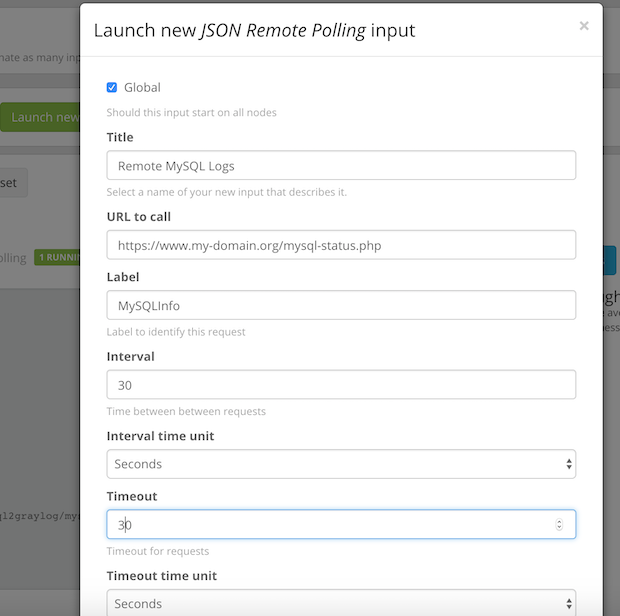

# JSON Remote Polling Input Plugin for Graylog

<!-- [](https://travis-ci.org/https://github.com/smxsm/graylog-json-remote-poll) -->

This is a Graylog Input plugin that enables you to poll remote URIs which should return single GELF messages as JSON output.
It supports Basic Auth and Proxies.
All the fields in the message will be stored, here is an example message which contains some MySQL status info:

```json
{
  "version": "1.0",
  "host": "mydomain",
  "short_message": "MySQL Status",
  "timestamp": 1543155515,
  "level": 1,
  "_Aborted_clients_per_second": 0,
  "_Aborted_connects_per_second": 0,
  "_Com_admin_commands_per_second": 0,
  "_Com_change_db_per_second": 0,
  "_Com_commit_per_second": 0,
  "_Com_delete_per_second": 0,
  "_Com_delete_multi_per_second": 0,
  "_Com_insert_per_second": 0,
  "_Com_insert_select_per_second": 0,
  "_Com_replace_per_second": 0,
  "_Com_select_per_second": 0,
  "_Com_set_option_per_second": 0,
  "_Com_show_collations_per_second": 0,
  "_Com_update_per_second": 0,
  "_Connections_per_second": 0,
  "_Created_tmp_disk_tables_per_second": 0,
  "_Created_tmp_files_per_second": 0,
  "_Created_tmp_tables_per_second": 0,
  "_Delayed_errors_per_second": 0,
  "_Delayed_insert_threads_per_second": 0,
  "_Delayed_writes_per_second": 0,
  "_Slow_queries_per_second": 0,
  "_Table_locks_immediate_per_second": 0,
  "_Table_locks_waited_per_second": 0,
  "_Innodb_buffer_pool_read_requests": 4319683,
  "_Innodb_buffer_pool_reads": 1163,
  "_Innodb_buffer_pool_write_requests": 133618,
  "_Max_used_connections": 23,
  "_Open_files": 2,
  "_Open_streams": 0,
  "_Open_table_definitions": 291,
  "_Open_tables": 416,
  "_Qcache_free_blocks": 1,
  "_Qcache_free_memory": 16760152,
  "_Threads_cached": 7,
  "_Threads_connected": 3,
  "_Threads_created": 82,
  "_Threads_running": 1
}
```

As an example, you can use [my simple PHP script](https://github.com/smxsm/php-mysql-gelf) to make some MySQL variables available for polling.

**Required Graylog version:** 2.0 and later

Installation
------------

[Download the plugin](https://github.com/https://github.com/smxsm/graylog-json-remote-poll/releases)
and place the `.jar` file in your Graylog plugin directory. The plugin directory
is the `plugins/` folder relative from your `graylog-server` directory by default
and can be configured in your `graylog.conf` file.

Restart `graylog-server` and you are done.

Usage
-----

After the plugin is installed, go to "System / Inputs" and launch a new _"JSON Remote Polling"_ input.
Enter the URL, set timeout, username, password etc. fields and start the input.



Getting started
---------------

This project is using Maven 3 and requires Java 8 or higher.

* Clone this repository.
* Run `mvn package` to build a JAR file.
* Optional: Run `mvn jdeb:jdeb` and `mvn rpm:rpm` to create a DEB and RPM package respectively.
* Copy generated JAR file in target directory to your Graylog plugin directory.
* Restart the Graylog.

